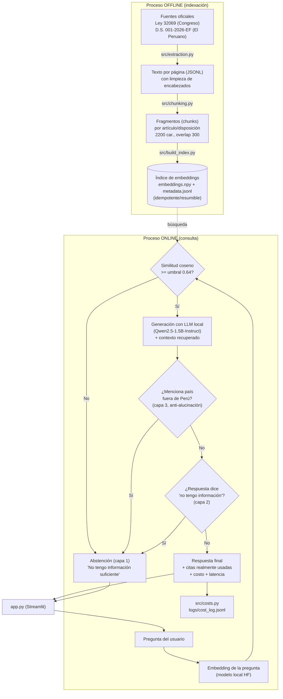

# Diagrama de pipeline — Tarea 1 (RAG Normativo)

Este diagrama es el que debe mostrarse en el video **antes** de cualquier línea de código
(regla "pipeline antes que código", ver enunciado del issue #187).

## Notas para el video

- El proceso **offline** (arriba) se corre una sola vez (o cuando cambian las fuentes); el
  **online** (abajo) corre en cada pregunta del usuario.
- Las **3 capas de abstención** (similitud, detección de rechazo del LLM, detección de
  alucinación de país) son el resultado de bugs reales encontrados probando la app en vivo — ver
  `docs/fase3_engine.md` y `docs/fase4_evaluacion.md` para el detalle de cada una.
- Evaluación (no está en este diagrama por claridad): `eval/run_eval.py` mide Recall@k sobre el
  índice, y `eval/results_full_generation.json` mide la tasa de abstención combinada end-to-end.
