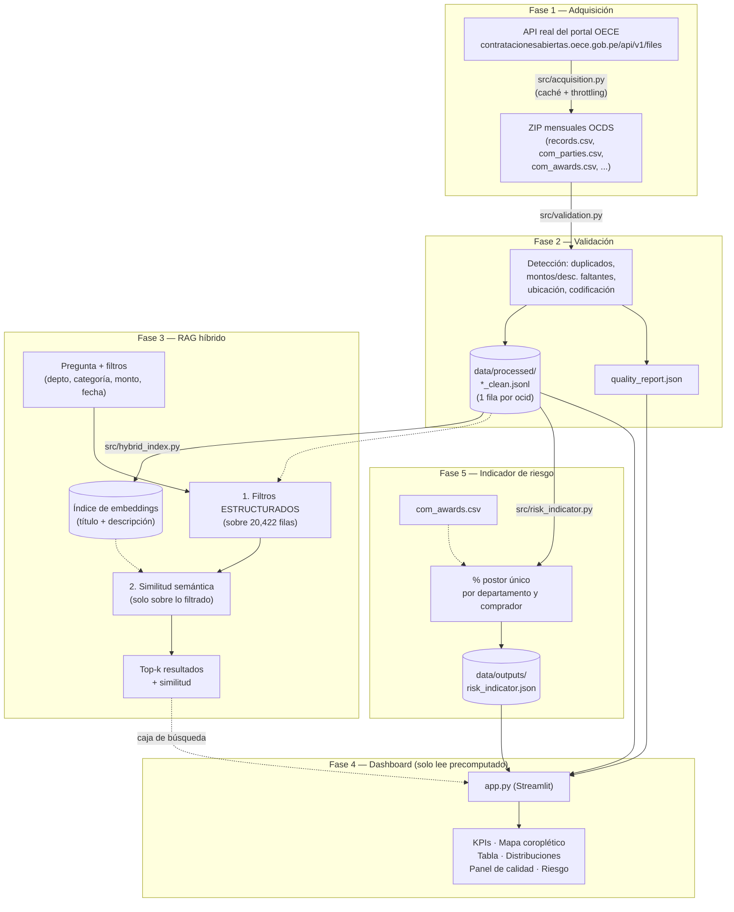

# Diagrama de pipeline — Tarea 2 (Radar de Contrataciones)

## Notas para el video

- El dashboard **nunca recalcula** validación, índice ni indicador de riesgo al abrirse — solo
  lee los archivos ya generados por las fases 2, 3 y 5 (ver enunciado: "Precomputed file reading,
  no real-time rebuilding").
- **Limitación real y medida** que conviene mostrar en el video sin maquillar: el Recall@5 del
  RAG híbrido es 0.3 (peor que en la Tarea 1), y el umbral de similitud de la Tarea 1 (0.64) **no
  transfiere** a este corpus — ver `docs/tarea2_fase3_rag_hibrido.md`.
- El indicador de riesgo es una **señal para investigar, no una prueba de irregularidad** (esto
  debe decirse explícitamente en el video, tal como lo exige el enunciado).
